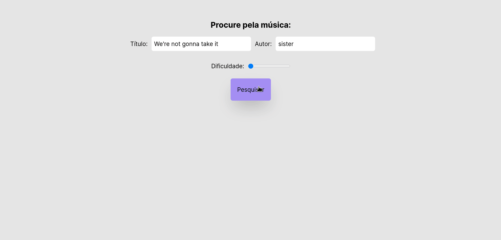
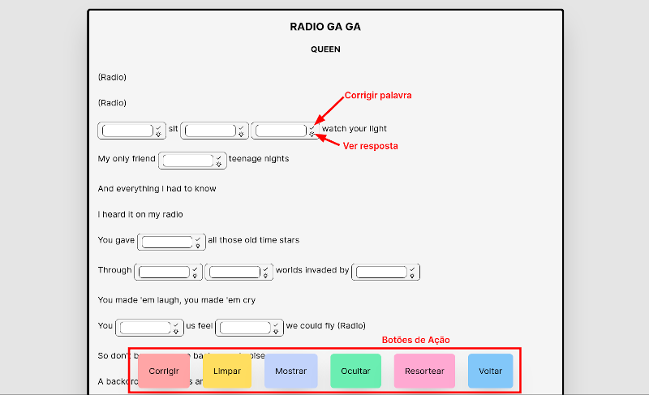

## 🎶 Completador de Música

[Clique aqui para ver o projeto online](https://completador-de-musica.vercel.app/)
## 💭 O que é este projeto?
Este projeto é uma aplicação web desenvolvida com os frameworks Next.js e Tailwind que tem como objetivo ajudar no estudo de línguas estrangeiras através de músicas. Uma vez na página inicial da aplicação você deve informar o nome de uma música e do seu autor, o que mostrará uma lista de músicas encontradas, então basta selecionar a música que você deseja, colocá-la para tocar em alguma plataforma como youtube ou spotify e preencher as lacunas presentes na letra com a palavra correta. As lacunas são sorteadas de maneira aleatória, o que permite que você sempre tenha palavras diferentes para completar e assim melhorar suas habilidades na língua que está tentando aprender.

## 🖥️ Como rodar este projeto?
Para iniciar a aplicação localmente, é preciso baixar este repositório (seja pelas opções de clone do Github ou através de um arquivo .zip) e modificar o arquivo chamado de **MODELO.env.local**. Esse arquivo precisa ser renomeado para **.env.local** e o valor da variável presente neste arquivo deve ser alterado para um valor válido de **client access token** obtido na API utilizada na aplicação, cuja documentação pode ser acessada [clicando aqui](https://docs.genius.com/).

Depois disso, na página principal do projeto será preciso rodar os comandos `npm i` para instalar as dependências e `npm run dev` para iniciar o projeto. Depois da compilação, o projeto estará disponível localmente através do endereço `localhost:3000`. 

*Obs: A porta 3000 é a porta padrão, mas recomendo que você veja em qual porta o projeto realmente será rodado através do terminal onde o comando `npm run dev` foi usado.*

Caso você queira acessar o projeto online, [clique aqui](https://completador-de-musica.vercel.app/) para ver o deploy feito na plataforma Vercel.

## 🤔 Como utilizar este projeto?
Na página inicial da aplicação você deve colocar o nome da música e da pessoa ou banda a qual esta música está associada. Nesta tela inicial você também pode selecionar a dificuldade da música. quanto maior a dificuldade, mais lacunas irão aparecer para que você complete. Uma vez que o nome e a autoria da música tenham sido selecionados, você deve clicar no botão de pesquisa. Isso fará com que uma lista com os resultados para a sua busca seja renderizada, e então basta clicar sobre o card que contém a música desejada, e aqui vale notar que como as músicas são obtidas através da API, músicas em vários idiomas estão disponíveis. Uma vez que você tenha clicado no card da música, a aplicação fará a navegação para a página de letra da música, que tem a interface abaixo:

Cada lacuna possui dois botões. O primeiro deles é o botão de correção indicado por um check que irá corrigir a lacuna atual deixando a borda verde se a palavra foi digitada corretamente e vermelha caso contrário. O segundo botão é o botão de dica representado por uma lâmpada. Este botão irá mostrar a palavra que deveria ser digitada naquela lacuna. Essas ações são individuais e aplicáveis apenas à lacuna atual.

Fora essas ações locais a interface contém seis botões de ações globais:

* Corrigir - Corrige todas as lacunas;
* Limpar - Limpa todas as lacunas apagando os textos digitados e retornando as bordas para a cor original;
* Mostrar - Mostra as respostas em todas as lacunas;
* Ocultar - Esconte todas as respostas em todas as lacunas;
* Resortear - Recarrega a página, o que implica no resorteio das lacunas que são colocadas de maneira aleatória;
* Voltar - Volta para a página de pesquisa.

## 🤝 Como contribuir com o projeto?
Eu sei que existem diversas melhorias que podem ser implementadas neste projeto com o passar do tempo, e também sei que provavelmente não terei tempo para fazer a maioria delas, por isso quero te convidar para contribuir com o projeto.

A primeira forma de contribuir com o projeto é abrindo issues no projeto falando um pouco sobre a feature que você quer que seja implementada, ou um bug que tenha encontrado (eu acabei não encontrando bugs o que provavelmente significa que não procurei por eles bem o suficiente hahaha). Se for possível, coloque alguma imagem relacionada ao assunto, porque facilita a visualização e o entendimento.

Caso você queira implementar algo com base no projeto, sinta-se a vontade. Esse projeto é open-source então você não precisa da minha permissão pra fazer qualquer coisa. É só fazer o fork do projeto e iniciar a sua implementação como achar melhor, e se você quiser mandar um pull request pro repositório com a sua implementação, sinta-se a vontade também. Só lembre-se de colocar uma mensagem dizendo que melhorias ou o que você implementou. Ah, e caso não queira fazer um PR mas tenha usado esse projeto como base, você pode abrir um issue aqui com o link do seu repositório porque pretendo fazer uma lista para que quem acesse este projeto consiga ter acesso também às implementações de outros usuários.

Se você quer fazer alguma coisa, mas não sabe o que fazer, pode dar uma olhada nas issues do projeto para ver se temos alguma coisa aberta e então é só pedir para que eu atribua aquela tarefa para você.

## Links importantes
* [Deploy da aplicação](https://completador-de-musica.vercel.app/)
* [Documentação Next.js](https://nextjs.org/docs)
* [Documentação Tailwind](https://tailwindcss.com/docs/installation)
* [Documentação Genius API](https://docs.genius.com/#/getting-started-h1)
